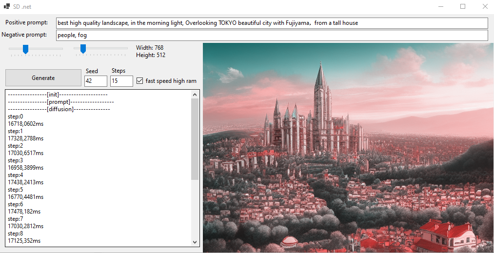

# Stable-Diffusion.NET-NCNN

A c# port of [Stable-Diffusion-NCNN](https://github.com/EdVince/Stable-Diffusion-NCNN) using [NcnnDotNet](https://github.com/takuya-takeuchi/NcnnDotNet) libraries.
The code uses only CPU and requires 12GB ram, against the 8GB of the original ncnn-based SD.

Project was created with Visual Studio 2022

## Usages

Download from [GDrive](https://drive.google.com/drive/folders/1myB4uIQ2K5okl51XDbmYhetLF9rUyLZS?usp=sharing) the 3 .bin models (about 2GB in total) and put them in the "[assets](https://github.com/andreae293/Stable-Diffusion.NET-NCNN/tree/main/stable-diffusion/bin/Debug/net6.0-windows/assets)" folder, then start the stable-diffusion.exe or compile it yourself.

